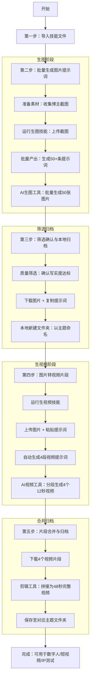
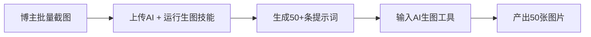
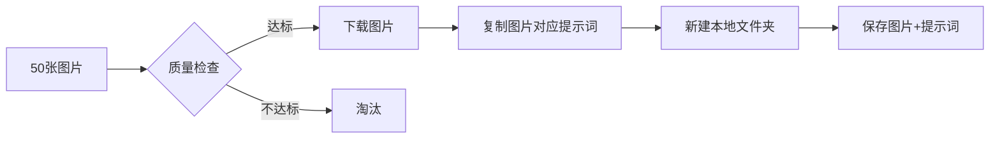
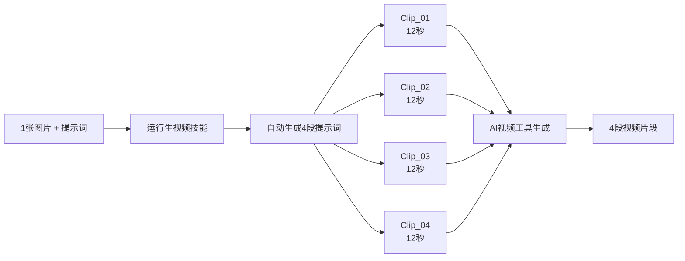

# AI生图生视频技能文件使用指南1.0

> **适用范围**：AI智能营销 / AI能力通用  
> **技能类型**：博主类型图片/视频批量生产

---

## 技能文件路径

| 技能类型 | 路径 |
|---------|------|
| 生图技能 | `AI生图生视频技能文件\AI生图技能文件博主类型` |
| 生视频技能 | `AI生图生视频技能文件\AI视频生成技能文件博主类型` |

---

## 技能文件核心特征与能力

### 【生图技能】去AI味提示词批量优化器

| 能力项 | 说明 |
|-------|------|
| 图片解析 | 将任意博主截图转化为高质量写实风格生图提示词 |
| 特征提取 | 自动提取人物五官、发型、穿搭、场景、光线等关键信息 |
| 瑕疵强制 | 强制输出真实皮肤瑕疵描述（毛孔、痘印、黑眼圈、唇部干纹等） |
| 风格把控 | 杜绝网红脸、蜡像感、塑料感、商业广告感 |
| 批量输出 | 单次可生成50+条独立提示词指令 |
| 质量保障 | 硬约束机制 + 强制质检清单 + 自进化规则库 |

### 【生视频技能】博主类型视频分镜策划器

| 能力项 | 说明 |
|-------|------|
| 图转视频 | 将一张图片（或图片提示词）扩展为4个连续12秒视频片段 |
| 动作设计 | 自动设计动作链承接（放松→拿物→讲解→靠近） |
| 情绪规划 | 自动规划情绪曲线递进（专注→分享→投入→亲切） |
| 一致性保障 | 人物形象、场景、瑕疵在4段视频中完全一致 |
| 双类型支持 | A类型（户外边走边说）+ B类型（室内固定位置） |
| 字符数控制 | 每段提示词严格450-500字符（硬上限500，无例外） |
| 模块协调 | 动作、道具、情绪、光线等模块自动校验不冲突 |

---

## 完整使用流程图



---

## 详细操作步骤

### 第一步：导入技能文件

在AI对话工具中导入对应的这2套技能文件。生图和生视频是两套独立技能，分别导入使用。

---

### 第二步：批量生成图片提示词



**操作说明：**

1. **准备素材**：收集任意短视频博主的截图（封面或内容页面均可），作为人物形象参考。

2. **运行生图技能**：将截图上传至AI，让生图技能文件运行。技能会自动解析图片中的人物特征、场景、光线等信息，生成符合"去AI味"标准的写实提示词。

3. **批量产出**：建议一次性上传50张图，生成至少50条提示词指令，每条指令对应1张图片。将这50条提示词分别输入AI生图工具，批量生成50张图片。

---

### 第三步：筛选确认与本地归档



**操作说明：**

1. **质量筛选**：逐一检查生成的图片，确认人物形象一致、写实度达标、无明显AI痕迹。

2. **本地归档**：
   - 选择质量OK的图片，下载保存
   - 在本地新建文件夹，以图片主题命名（如"办公室真实大头"、"会议室职场女性"等）
   - 同时复制并保存该图片对应的生图提示词（后续生成视频需要用到）

---

### 第四步：图片转视频片段



**操作说明：**

1. **运行生视频技能**：导入视频生成技能文件。

2. **输入素材**：
   - 粘贴该图片的生图提示词

3. **自动生成4段视频提示词**：技能会自动策划4个连续的12秒视频片段提示词（动作链承接、情绪递进、场景一致）。

4. **分段生成视频**：将4个片段提示词分别输入AI视频生成工具，生成4段12秒视频。

---

### 第五步：片段合并与归档


**操作说明：**

1. **下载视频片段**：将生成的4个视频片段下载至本地。

2. **合并视频**：使用剪辑工具将4段视频按顺序拼接，形成一条完整的48秒博主视频。

3. **统一归档**：将合并后的视频保存至对应图片主题的文件夹内（与源图片放在一起）。

---

## 最终产出与应用场景

| 应用场景 | 说明 |
|---------|------|
| 数字人形象素材库 | 批量生产可复用的数字人视频素材 |
| 短视频内容批量生产 | 规模化产出博主风格内容 |
| 真人博主IP形象测试 | 低成本验证不同人设的市场反应 |

---

## 核心优势

- **人物一致**：全流程保持人物形象高度一致
- **写实无AI感**：去除蜡像感、塑料感、网红化修饰
- **批量规模化**：支持50+图片 × 4视频片段的规模化生产
- **质量可控**：硬约束机制 + 强制质检 + 模块协调
- **通用适配**：适用于任意博主类型、任意场景风格

---

## 文件夹结构示例

```
本地归档文件夹/
├── 办公室真实风格1/
│   ├── 源图片.png
│   ├── 生图提示词.txt
│   ├── Clip_01.mp4
│   ├── Clip_02.mp4
│   ├── Clip_03.mp4
│   ├── Clip_04.mp4
│   └── 完整视频_48秒.mp4
├── 会议室职场女性风格1/
│   ├── ...
└── 户外旅行风格1/
    ├── ...
```

---

> **版本**：V1.0  
> **更新日期**：2026-02-10  
> **维护路径**：`AI生图生视频技能文件\
